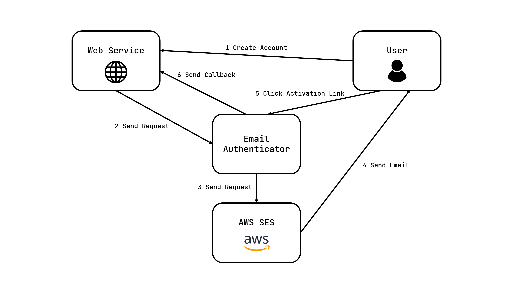

# Email Authenticator

Email authentication server using AWS SES.

## Diagram



## Web API

Uses REST API.

### /auth

#### POST /auth/start

Start authentication and send email.

Key is the password for using this server.

* Request Body JSON
```json
{
  "key": "string",
  "title": "string",
  "email": "string",
  "callback": "string"
}
```

* Response JSON
```json
{
  "code": "string"
}
```

#### GET /auth/:code

User should click this link to authenticate.

* Request Param
```
code : string
```

## Configuration

### server.json
```json
{
  "host": "http://localhost",
  "port": 8080,
  "key": "password"
}
```

### aws.json
```json
{
  "accessKeyId": "IAM access key id",
  "secretAccessKey": "IAM secret access key",
  "region": "SES region",
  "sender": "SES email address"
}
```
